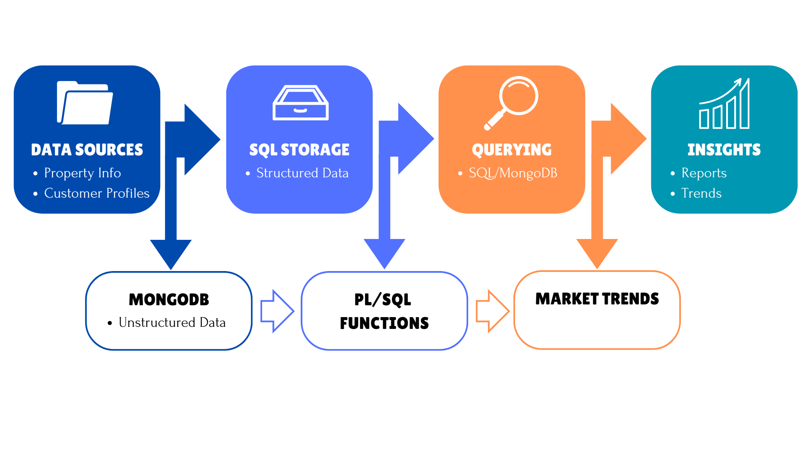
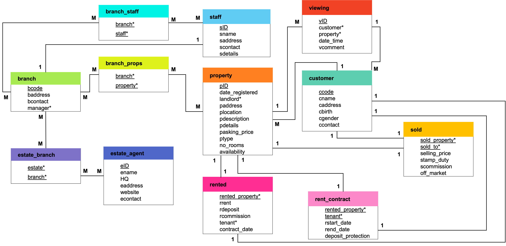

# 🏡 PropertyPortal: Real Estate Data Management System

## 📌 Motivation
This project aims to design a comprehensive real estate database system that integrates both **relational (Oracle SQL)** and **non-relational (MongoDB)** models.

The goal was to simulate a real-world property management system that could handle information on properties, customers, staff, viewings, and contracts. Emphasis was placed on:
- **Designing a normalized schema** to 3rd Normal Form (3NF)
- **Building and populating relational tables** with realistic data
- **Creating analytical queries** to extract business insights
- **Modeling NoSQL documents** for flexible data retrieval

This system supports a hybrid data environment and demonstrates the strengths of structured and semi-structured database design for real estate operations.

## ⚙️ Project Workflow
1. Requirements gathering and data analysis
2. Logical schema design using normalization (to 3NF)
3. Schema implementation using Oracle SQL
4. Data population with realistic sample values
5. Querying the system using SQL and PL/SQL
6. Translating the schema to MongoDB collections
7. Evaluating query outputs and validating system integrity.



## 📊 Exploratory Data Overview
This project extracts meaningful insights from a relational database through structured queries, including:
- Distribution of property types across locations.
- Customer viewing behavior and contract trends.
- Branch-wise staff allocation and performance.

Example SQL query to analyze property pricing trends:
```sql
SELECT PLOCATION, AVG(PASKING_PRICE) AS AVG_PRICE
FROM PROPERTY
GROUP BY PLOCATION
ORDER BY AVG_PRICE DESC;
```

## 🔧 Data Processing
1. Normalization to 3rd Normal Form (3NF) to remove redundancy.
2. Primary and Foreign Key Constraints to ensure relational integrity.
3. Data Cleaning & Validation through SQL constraints (CHECK, UNIQUE).

**Entity-Relationship Diagram (ERD):**


## 🛠️ Model Implementation

### ✅ Relational Database (SQL - Oracle 11g)
- Tables & Relationships defined via CREATE TABLE statements.
- Data Insertion through INSERT INTO commands.
- Complex Queries leveraging JOIN, GROUP BY, and AGGREGATE FUNCTIONS.

Example SQL query:
```sql
SELECT S.SNAME, COUNT(V.VID) AS TOTAL_VIEWINGS
FROM STAFF S
JOIN EMPLOYMENT E ON S.SID = E.STAFF
JOIN BRANCH B ON E.BRANCH = B.BCODE
JOIN MANAGED_P MP ON B.BCODE = MP.BRANCH
JOIN PROPERTY P ON MP.PROPERTY = P.PID
JOIN VIEWING V ON P.PID = V.PROPERTY
GROUP BY S.SNAME;
```

### 🛠️ NoSQL Implementation (MongoDB)
- Flexible Document-Based Storage for property listings.
- Aggregation Pipelines for analysis.
- Example Query: Find all available properties under $500,000
```js
db.properties.find({
  asking_price: { $lt: 500000 },
  availability: { $gte: new Date() }
});
```

## 🎯 Key Insights

📍 A Well-Normalized Schema Enables Complex Queries  
Designing the database in 3NF made it easy to join related tables and run complex SQL queries, such as tracking staff performance or analyzing property availability by type and location.

📍 Staff Performance Can Be Quantified Through Data  
SQL joins and aggregations revealed which staff members closed the most deals, how many properties were sold or rented under their management, and overall branch activity.

📍 Property Distribution Reflects Business Trends  
Query results highlighted areas with higher listing volumes and revealed that certain property types (e.g. rentals) were more prevalent in specific regions.

📍 Enforcing Referential Integrity Prevents Data Issues  
Using foreign key constraints ensured consistency between related tables, but also required careful planning during data insertion and query testing.

📍 Realistic Sample Data Brings the System to Life  
Populating the schema with realistic test data enabled meaningful insights and demonstrated how the system could be used in a real-world business context.

